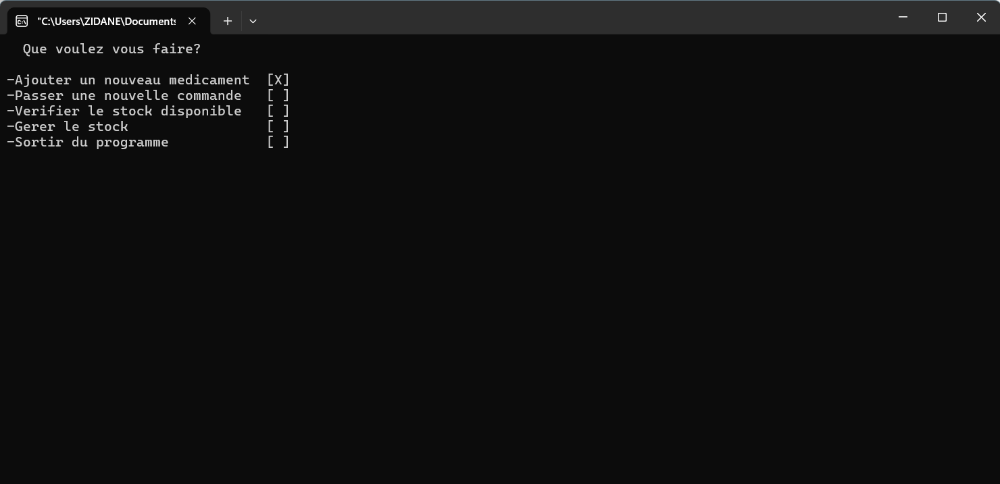

# Pharmacy Management System in C

Ce projet est un système de gestion de pharmacie interactif développé en langage C lors de ma 1ère année de classe préparatoire.

## Fonctionnalités
- **Gestion de Stock :** Ajout, modification et suppression de médicaments.
- **Interface Interactive :** Menu de navigation fluide avec les touches du clavier.
- **Persistance des données :** Sauvegarde automatique dans un fichier binaire `.dat`.
- **Système de commande :** Génération automatique de bons de commande et gestion des rendus de monnaie.

## Aperçu

## Technologies utilisées
- Langage C
- Bibliothèques standards : stdio.h, stdlib.h, windows.h, conio.h
